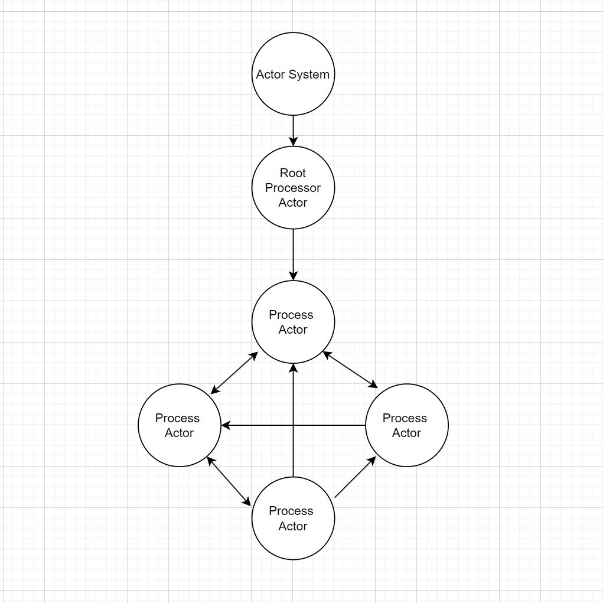
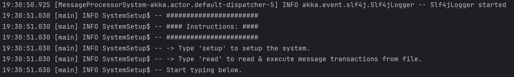

# Snapshot Algorithms in Distributed Systems

This project implements two snapshot algorithms, Chandy-Lamport and Lai-Yang, using Akka actors in Scala. Each algorithm is implemented in a separate package within the project.

## Packages

1. **ChandyLamport**: Contains the implementation of the Chandy-Lamport snapshot algorithm.
   - To execute: `sbt "runMain com.snapshot.ChandyLamport.ChandyLamportSnapshot"`
   - It prompts the user to input `setup` to set up the Akka system and `read` to read transactions from the `transactions1.txt` file stored in the resources folder.
   - After successful execution, snapshots for each process are stored in the `snapshots` folder in JSON format.
<br/>

2. **LaiYang**: Contains the implementation of the Lai-Yang snapshot algorithm.
   - To execute: `sbt "runMain com.snapshot.LaiYang.LaiYangSnapshot"`
   - It prompts the user to input `setup` to set up the Akka system and `read` to read transactions from the `transactions2.txt` file stored in the resources folder.
   - After successful execution, snapshots for each process are stored in the `snapshots` folder in JSON format.

### Files Details
- **`ChandyLamportSnapshot.scala`**: Contains the overall implementation of Chandy Lamport Snapshot algorithm

- **`LaiYangSnapshot.scala`**: Contains the overall implementation of Lai Yang Snapshot algorithm

- **`GraphParser.scala`**: parses the `graph.ngs.dot` file to Graph

- **`FileUtils.scala`**: contains the functions for file handling

- **`MyLogger.scala`**: Custom logger using slf4j library

- **`application.conf`** contains the configurations of application

- **`graph.ngs.dot`** contains the edges between nodes

- **`transactions.txt`** stores the message transactions input 

### Workflow
<div style="text-align:center;">
    
</div>


The diagram depicts the design of my Akka system, which is used for implementing two algorithms. There are two types of actors: the RootProcessor Actor, responsible for handling transactions read from a file and propagating them to Process Actors; and the Process Actors, which simulate the processes of a distributed system. They communicate with one another through message passing.

The implementation of the Process Actor differs between the two algorithms. In the Chandy-Lamport algorithm, a Marker message is used to prompt other processes to take a local snapshot, whereas in the Lai-Yang algorithm, a control message is sent in response to the channel's non-FIFO behavior to coordinate the snapshot process.


### Usage

1. Clone the repository:
   ``` 
   git clone git@github.com:Chintan45/snapshots-in-distributed-system.git 
   ```
2. Navigate to the project directory:
    ```
    cd snapshots-in-distributed-system
    ```
3. Compile and run the Chandy-Lamport algorithm:
    ```
    sbt "runMain com.snapshot.ChandyLamport.ChandyLamportSnapshot"
    ```
4. Compile and run the Lai-Yang algorithm:
    ```
    sbt "runMain com.snapshot.LaiYang.LaiYangSnapshot"
    ```
5. Follow the prompts to **set up the Akka system** and **read transactions** from the files.


6. After execution, find the snapshots stored in the snapshots folder for each process in json formate like
```
{
  "processId" : "2",
  "state" : {
    "02" : [ "m1", "m5", "m7"],
    "12" : [ "m2", "m3" ]
  }
}
```

### Run Testcases
```
sbt test
```

### Dependencies
- **Scala version**: 2.13.13
- **sbt version**: 1.9.9
- **Akka Actors**: 2.8.5
- **ScalaTest**: 3.2.18
- **Typesafe Config**: 1.4.3
- **Play JSON**: 2.10.4
- **Logback Classic**: 1.5.6
- **SLF4J API**: 2.0.12

